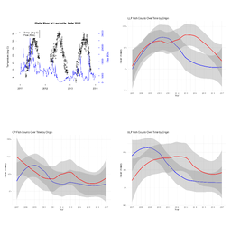

```{r setup, include=FALSE}
knitr::opts_chunk$set(echo = TRUE)
library(tidyverse) #useful functions to make plots
library(dplyr) 
library(popdemo) #matrix modeling library
library(vegan)
library(lubridate)
library(tidyr)
library(scales)
library(reshape2)
library(dataRetrieval)
library(magick)
library(knitr)
```

# 1. Initial Analysis- creates fish_vegan and numeric_data
This next section will reformat the data in such a way that the vegan program can analyze it.
  fish_vegan = left column is segment for each day, all other columns are fish species
  numeric_data = fish_vegan but no left column for each segment per day (this is what vegan package will use to calculate    shannon diversity)

```{r}
#View(platte_fish_cleaned)
dat <- read.csv("/Users/robin/Documents/GitHub/R_Project_2023/BIOS967_Rodenburg/data/Platte_Fish_Cleaned.csv")

fish_vegan <- dat %>% #select(-X) %>%
  filter(Segment != "NA") %>%
  group_by(Segment, Year, Month, Day, Species) %>%
  summarise(count_use=sum(Count)) %>%
  mutate(sample_id=paste(Segment, Year, Month, Day, sep="-")) %>%
  pivot_wider(id_cols=sample_id, names_from=Species, values_from=count_use)

fish_vegan[is.na(fish_vegan)] <- 0 #converts NA's to 0s
#View(fish_vegan)

numeric_data <- fish_vegan %>% select(-sample_id) #remove non-integer column
#numeric_data <- fish_vegan %>% select_if(is.numeric) #also removes any non-integer columns
print(fish_vegan)

native_fish_vegan <- native_fish %>% 
  group_by(Segment, Year, Month, Day, Species) %>%
  summarise(count_use=sum(Count)) %>%
  mutate(sample_id=paste(Segment, Year, Month, Day, sep="-")) %>%
  pivot_wider(id_cols=sample_id, names_from=Species, values_from=count_use)

nonnative_fish_vegan <- nonnative_fish %>% 
  group_by(Segment, Year, Month, Day, Species) %>%
  summarise(count_use=sum(Count)) %>%
  mutate(sample_id=paste(Segment, Year, Month, Day, sep="-")) %>%
  pivot_wider(id_cols=sample_id, names_from=Species, values_from=count_use)

native_fish_vegan[is.na(native_fish_vegan)] <- 0 #converts NA's to 0s
nonnative_fish_vegan[is.na(nonnative_fish_vegan)] <- 0 #converts NA's to 0s

native_numeric_data <- native_fish_vegan %>% select(-sample_id) #remove non-integer column
nonnative_numeric_data <- nonnative_fish_vegan %>% select(-sample_id) #remove non-integer column

print(nonnative_fish_vegan)
print(nonnative_numeric_data)
#numeric_data <- fish_vegan %>% select_if(is.numeric) #also removes any non-integer columns
```

#2 Shannon diversity calculation for each sample collection (one site per day), then create a histogram 

```{r}
# Calculate Chao1 using the specpool() function
chao1_values <- specpool(numeric_data)$Chao1
native_chao1_values <- specpool(native_numeric_data)$Chao1
nonnative_chao1_values <- specpool(nonnative_numeric_data)$Chao1

# If the specpool() function doesn't work, you can alternatively try this:
# chao1_values <- estimateR(numeric_data)[, "Chao1"]

# Calculate other diversity indices
diversity_indices <- list(
  Shannon = diversity(numeric_data, index = "shannon"),
  Simpson = diversity(numeric_data, index = "simpson"),
  InverseSimpson = diversity(numeric_data, index = "invsimpson"),
  FisherAlpha = specnumber(numeric_data) - 1,
  Richness = specnumber(numeric_data),
  Evenness = diversity(numeric_data, index = "shannon") / log(specnumber(numeric_data))
)

native_diversity_indices <- list(
  Shannon = diversity(native_numeric_data, index = "shannon"),
  Simpson = diversity(native_numeric_data, index = "simpson"),
  InverseSimpson = diversity(native_numeric_data, index = "invsimpson"),
  FisherAlpha = specnumber(native_numeric_data) - 1,
  Richness = specnumber(native_numeric_data),
  Evenness = diversity(native_numeric_data, index = "shannon") / log(specnumber(native_numeric_data))
)


nonnative_diversity_indices <- list(
  Shannon = diversity(nonnative_numeric_data, index = "shannon"),
  Simpson = diversity(nonnative_numeric_data, index = "simpson"),
  InverseSimpson = diversity(nonnative_numeric_data, index = "invsimpson"),
  FisherAlpha = specnumber(nonnative_numeric_data) - 1,
  Richness = specnumber(nonnative_numeric_data),
  Evenness = diversity(nonnative_numeric_data, index = "shannon") / log(specnumber(nonnative_numeric_data))
)
# Add Chao1 to the list
diversity_indices$Chao1 <- chao1_values
native_diversity_indices$Chao1 <- chao1_values
nonnative_diversity_indices$Chao1 <- chao1_values

# Convert the list to a dataframe
diversity_data <- as.data.frame(do.call(cbind, diversity_indices))
native_diversity_data <- as.data.frame(do.call(cbind, native_diversity_indices))
nonnative_diversity_data <- as.data.frame(do.call(cbind, nonnative_diversity_indices))

```


```{r}
diversity_data_extend <- cbind(diversity_data, sample_id = fish_vegan$sample_id) %>% 
  separate(sample_id, into = c("Segment", "Year", "Month", "Day"), sep = "-") %>%
  filter(Segment != "NA") %>% 
  mutate(Segment = factor(Segment, levels = c("CP", "ULP", "ELK", "LLP", "PMC"))) %>% 
  mutate(Date = as.Date(paste(Year, Month, Day, sep = "-"), format = "%Y-%m-%d")) %>% 
  select(-Year, -Month, -Day)

native_diversity_data_extend <- cbind(native_diversity_data, sample_id = native_fish_vegan$sample_id) %>% 
  separate(sample_id, into = c("Segment", "Year", "Month", "Day"), sep = "-") %>%
  filter(Segment != "NA") %>% 
  mutate(Segment = factor(Segment, levels = c("CP", "ULP", "ELK", "LLP", "PMC"))) %>% 
  mutate(Date = as.Date(paste(Year, Month, Day, sep = "-"), format = "%Y-%m-%d")) %>% 
  select(-Year, -Month, -Day)

nonnative_diversity_data_extend <- cbind(nonnative_diversity_data, sample_id = nonnative_fish_vegan$sample_id) %>% 
  separate(sample_id, into = c("Segment", "Year", "Month", "Day"), sep = "-") %>%
  filter(Segment != "NA") %>% 
  mutate(Segment = factor(Segment, levels = c("CP", "ULP", "ELK", "LLP", "PMC"))) %>% 
  mutate(Date = as.Date(paste(Year, Month, Day, sep = "-"), format = "%Y-%m-%d")) %>% 
  select(-Year, -Month, -Day)
# View the results

#creates a new variable that bunches the samples by season. 
diversity_data_extend <- diversity_data_extend %>%
  arrange(Date) %>%
  mutate(SeasonGroup = cumsum(c(TRUE, diff(Date) > 90))) # assuming a break of more than 90 days indicates a new season

#creates a new variable that bunches the samples by season. 
native_diversity_data_extend <- native_diversity_data_extend %>%
  arrange(Date) %>%
  mutate(SeasonGroup = cumsum(c(TRUE, diff(Date) > 90))) # assuming a break of more than 90 days indicates a new season

#creates a new variable that bunches the samples by season. 
nonnative_diversity_data_extend <- nonnative_diversity_data_extend %>%
  arrange(Date) %>%
  mutate(SeasonGroup = cumsum(c(TRUE, diff(Date) > 90))) # assuming a break of more than 90 days indicates a new season

diversity_data_extend <- diversity_data_extend %>%
  mutate(
    Season = case_when(
      Date >= as.Date(paste(year(Date), "01-01", sep = "-")) & Date <= as.Date(paste(year(Date), "04-30", sep = "-")) ~ "Spring",
      Date >= as.Date(paste(year(Date), "05-01", sep = "-")) & Date <= as.Date(paste(year(Date), "07-31", sep = "-")) ~ "Summer",
      Date >= as.Date(paste(year(Date), "08-01", sep = "-")) & Date <= as.Date(paste(year(Date), "12-31", sep = "-")) ~ "Fall",
      #TRUE ~ NA_character_ # Assigns NA to any dates that don't fit the above criteria
    )
  )

diversity_data_extend <- diversity_data_extend %>%
  mutate(
    Subcategory = case_when(
      Season == "Spring" & month(Date) %in% c(01, 02) ~ "Early",
      Season == "Spring" & month(Date) == 03 ~ "Middle",
      Season == "Spring" & month(Date) == 04 ~ "Late",
      Season == "Summer" & month(Date) == 05 ~ "Early",
      Season == "Summer" & month(Date) == 06 ~ "Middle",
      Season == "Summer" & month(Date) == 07 ~ "Late",
      Season == "Fall" & month(Date) == 08 ~ "Early",
      Season == "Fall" & month(Date) == 09 ~ "Middle",
      Season == "Fall" & month(Date) %in% c(10, 11, 12) ~ "Late",
      TRUE ~ NA_character_
    )
  )


print(diversity_data_extend)

#PLOTTING A HISTOGRAM OF ALL SHANNON DIVERSITY NUMBERS IN shannon_div
ggplot(data.frame(Shannon_Diversity = diversity_data_extend$Shannon), aes(x = Shannon_Diversity)) +
  geom_histogram(binwidth = 0.1, fill = "dodgerblue", color = "black", alpha = 0.7) +
  labs(title = "Distribution of Shannon Diversity", x = "Shannon Diversity", y = "Number of Samples")
```
This plots the 

```{r}
# Filter data for the desired time range (2010-2014)
filtered_data <- diversity_data_extend %>%
  filter(Date >= "2007-01-01" & Date <= "2017-12-31")

diversity_plot <- ggplot(filtered_data, aes(x = Date, group = SeasonGroup)) +
  geom_smooth(aes(y = Shannon, color = "Shannon")) +
  geom_smooth(aes(y = Richness/10, color = "Richness (scaled)")) +
  geom_smooth(aes(y = Simpson, color = "Simpson")) +
  labs(x = "Year", y = "Diversity") +
  ggtitle("Diversity Indeces Over Time")

# Print the plot
print(diversity_plot)


# Print the plot
#nlkprint(diversity_plot)
```
Okay, now Kate brilliantly suggested that I should plot this^ and then just the diversity indeces of native species...!! OO good idea, here it goes:

```{r}
#first I have to find the diversity data for just native species!

native_filtered_data <- native_diversity_data_extend %>%
  filter(Date >= "2007-01-01" & Date <= "2017-12-31")

nonnative_filtered_data <- nonnative_diversity_data_extend %>%
  filter(Date >= "2007-01-01" & Date <= "2017-12-31")

native_diversity_plot <- ggplot(native_filtered_data, aes(x = Date, group = SeasonGroup)) +
  geom_smooth(aes(y = Shannon, color = "Shannon")) +
  geom_smooth(aes(y = Richness/10, color = "Richness (scaled)")) +
  geom_smooth(aes(y = Simpson, color = "Simpson")) +
  labs(x = "Year", y = "Diversity") +
  ggtitle("Native Diversity Indeces Over Time")

# Print the plot
print(native_diversity_plot)
```
```{r}
all_fish_data <- filtered_data %>%
  select(Date, Shannon) %>%
  mutate(Type = "All Fish")

native_fish_data <- native_filtered_data %>%
  select(Date, Shannon) %>%
  mutate(Type = "Native Fish")

nonnative_fish_data <- nonnative_filtered_data %>%
  select(Date, Shannon) %>%
  mutate(Type = "Nonnative Fish")

combined_data <- rbind(all_fish_data, native_fish_data, nonnative_fish_data)

combined_diversity_plot <- ggplot(combined_data, aes(x = Date, y = Shannon, color = Type, group = Type)) +
  geom_smooth() +
  labs(x = "Year", y = "Shannon Diversity", color = "Type") +
  ggtitle("Shannon Diversity Over Time for All Fish vs. Native Fish")

# Print the plot
print(combined_diversity_plot)

```
```{r}
# Calculate the average body length by year for all fish
average_length_yearly_all <- platte_fish_extended %>%
  group_by(Year) %>%
  summarize(AverageLength = mean(Length, na.rm = TRUE)) %>%
  ungroup()

# Plot the average body length across time for all fish
ggplot(average_length_yearly_all, aes(x = Year, y = AverageLength)) +
  geom_smooth() +  # Line plot
  geom_point() +  # Points for each year
  labs(title = "Average Body Length Over Time (All Fish)",
       x = "Year",
       y = "Average Body Length") +
  theme_minimal()
```
```{r}
library(ggplot2)
library(dplyr)

# Calculate the average body length by year for native and nonnative fish
average_length_yearly_grouped <- platte_fish_extended %>%
  group_by(Year, Origin) %>%
  summarize(AverageLength = mean(Length, na.rm = TRUE)) %>%
  ungroup()

# Plot the average body length across time for native and nonnative fish
ggplot(average_length_yearly_grouped, aes(x = Year, y = AverageLength, color = Origin)) +
  geom_smooth() +  # Line plot
  geom_point() +  # Points for each year
  scale_x_continuous(breaks = unique(average_length_yearly_grouped$Year)) +  # Specify x-axis breaks to be each year
  labs(title = "Average Body Length Over Time by Fish Type",
       x = "Year",
       y = "Average Body Length",
       color = "Type") +
  theme_minimal() +
  theme(axis.text.x = element_text(angle = 45, hjust = 1))  # Rotate x-axis labels for readability

```


# Calculates all the Monthly Averages
```{r}
monthly_avg_shannon <- diversity_data_extend %>%
  mutate(MonthYear = floor_date(Date, "month")) %>% # Creates a new column with the first date of each month
  group_by(MonthYear) %>%
  summarise(AvgShannon = mean(Shannon, na.rm = TRUE)) # Computes the average Shannon diversity per month

monthly_avg_richness <- diversity_data_extend %>%
  mutate(MonthYear = floor_date(Date, "month")) %>% # Creates a new column with the first date of each month
  group_by(MonthYear) %>%
  summarise(AvgRichess = mean(Richness, na.rm = TRUE)) # Computes the average Shannon diversity per month

monthly_avg_simpson <- diversity_data_extend %>%
  mutate(MonthYear = floor_date(Date, "month")) %>% # Creates a new column with the first date of each month
  group_by(MonthYear) %>%
  summarise(AvgSimpson = mean(Simpson, na.rm = TRUE)) # Computes the average Shannon diversity per month

monthly_avg_evenness <- diversity_data_extend %>%
  mutate(MonthYear = floor_date(Date, "month")) %>% # Creates a new column with the first date of each month
  group_by(MonthYear) %>%
  summarise(AvgEvenness = mean(Evenness, na.rm = TRUE)) # Computes the average Shannon diversity per month
```

```{r}
#yearly_avg_diversity <- diversity_data_extend %>%
  #mutate(Year = year(Date)) %>%  # Extracts the year from the Date
 # group_by(Year, Season, Subcategory) %>%
  #summarise(AvgShannon = mean(Shannon, na.rm = TRUE))

#plot <- ggplot(yearly_avg_diversity, aes(x = Year, y = AvgShannon, color = Subcategory)) +
  #geom_point() +  # You can use geom_line() if you prefer to connect the points
 # geom_smooth(method = "loess", se = FALSE) +  # Adds a smoothed line through the points
  #labs(x = "Year", y = "Average Shannon Diversity", title = "Yearly Average Shannon Diversity by Subcategory") +
 # theme_minimal()

#print(plot)

filtered_data_extra <- diversity_data_extend %>%
  filter(Date >= "2012-01-01" & Date <= "2013-01-01")

diversity_plot <- ggplot(filtered_data_extra, aes(x = Date, group = SeasonGroup)) +
  geom_smooth(aes(y = Shannon, color = Season)) +  # Color by Season
  scale_color_manual(values = c("Spring" = "green4", "Summer" = "yellow4", "Fall" = "brown4")) +
  labs(x = "2012", y = "Diversity", color = "Season") +
  ggtitle("Shannon Diveristy Indices in 2012") +
  theme_minimal()

print(diversity_plot)

filtered_data_segment <- diversity_data_extend %>%
  filter(Date >= "2011-01-01" & Date <= "2014-01-01") %>% 
  filter(!Segment %in% c("PMC", "ELK"))

segment_plot <- ggplot(filtered_data_segment, aes(x = Date, y = Shannon, group = interaction(SeasonGroup, Segment), color = Segment)) +
  geom_point() +
  geom_smooth() +
  labs(x = "Date", y = "Shannon Diversity", color = "Segment") +
  ggtitle("Shannon Diversity by Segment and SeasonGroup Over Time") +
  theme_minimal()

# Print the plot
print(segment_plot)

```


```{r}
platte_fish_cleaned <- platte_fish_cleaned %>%
  mutate(Count = as.numeric(as.character(Count)))

#separating out all the differet types of sturegeon
sturgeon_data <- platte_fish_cleaned %>%
  filter(Species %in% c(20,24,26,27,28))

sturgeon_data <- sturgeon_data %>%
  filter(!is.na(Count))

# Summarize the data to get the total count per year (or per month if needed)
sturgeon_count_yearly <- sturgeon_data %>%
  group_by(Year) %>%
  summarize(Total_Count = sum(Count, na.rm = TRUE)) %>%
  ungroup()

# Plot the Sturgeon count over time
ggplot(sturgeon_count_yearly, aes(x = Year, y = Total_Count)) +
  geom_smooth(color = "brown") +
  #geom_line() +  # Add lines connecting the points
  #geom_point(color = "brown") +  # Add points
  scale_x_continuous(breaks = unique(sturgeon_count_yearly$Year)) +  # Specify x-axis breaks to be each year
  labs(title = "Sturgeon Populations Over Time",
       x = "Year",
       y = "Total Count") +
  theme_minimal() +
  theme(axis.text.x = element_text(angle = 45, hjust = 1))  # Rotate x-axis labels for readability

sturgeon_min_length <- min(sturgeon_data$Length, na.rm = TRUE)
sturgeon_max_length <- max(sturgeon_data$Length, na.rm = TRUE)
sturgeon_mean_length <- mean(sturgeon_data$Length, na.rm = TRUE)
sturgeon_min_weight <- min(sturgeon_data$Weight, na.rm = TRUE)
sturgeon_max_weight <- max(sturgeon_data$Weight, na.rm = TRUE)
sturgeon_mean_weight <- mean(sturgeon_data$Weight, na.rm = TRUE)

# Filter the data for species 26
pallid_data <- platte_fish_cleaned %>%
  filter(Species == 26)

# Count the number of times species 26 was found
num_occurrences <- nrow(pallid_data)

# Sum up the count of species 26
total_count_pallid<- sum(pallid_data$Count, na.rm = TRUE)

# Print the results
print(paste("Pallid Sturgeon was found", num_occurrences, "times with a total count of", total_count_pallid, "individuals."))
```
```{r}
# Calculate the average body length by year
average_length_yearly <- sturgeon %>%
  group_by(Year) %>%
  summarize(AverageLength = mean(Length, na.rm = TRUE)) %>%
  ungroup()

# Plot the average body length across time
ggplot(average_length_yearly, aes(x = Year, y = AverageLength)) +
  geom_smooth(color = "brown") +  # Line plot
  #geom_point() +  # Points for each year
  scale_x_continuous(breaks = unique(average_length_yearly$Year)) +  # Specify x-axis breaks to be each year
  labs(title = "Average Sturgeon Body Length Over Time",
       x = "Year",
       y = "Average Body Length (mm)") +
  theme_minimal()
```


```{r}
platte_fish_cleaned <- platte_fish_cleaned %>%
  mutate(Count = as.numeric(as.character(Count)))

#separates just the catfish
catfish_data <- platte_fish_cleaned %>%
  filter(Species %in% c(300,350,355,360,365,370))

catfish_data <- catfish_data %>%
  filter(!is.na(Count))

# Summarize the data to get the total count per year (or per month if needed)
catfish_count_yearly <- catfish_data %>%
  group_by(Year) %>%
  summarize(Total_Count = sum(Count, na.rm = TRUE)) %>%
  ungroup()

# Plot the catfish count over time
ggplot(catfish_count_yearly, aes(x = Year, y = Total_Count)) +
  geom_smooth() +
  #geom_line() +  # Add lines connecting the points
  #geom_point(color = "blue") +  # Add points
  scale_x_continuous(breaks = unique(catfish_count_yearly$Year)) +  # Specify x-axis breaks to be each year
  labs(title = "Catfish Population Over Time",
       x = "Year",
       y = "Total Count") +
  theme_minimal() +
  theme(axis.text.x = element_text(angle = 45, hjust = 1))  # Rotate x-axis labels for readability
```
```{r}
# Calculate the average body length by year
catfish_average_length_yearly <- catfish %>%
  group_by(Year) %>%
  summarize(AverageLength = mean(Length, na.rm = TRUE)) %>%
  ungroup()

# Plot the average body length across time
ggplot(catfish_average_length_yearly, aes(x = Year, y = AverageLength)) +
  geom_smooth() +  # Line plot
  #geom_point() +  # Points for each year
  scale_x_continuous(breaks = unique(catfish_average_length_yearly$Year)) +  # Specify x-axis breaks to be each year
  labs(title = "Average Catfish Body Length Over Time",
       x = "Year",
       y = "Average Body Length (mm)") +
  theme_minimal()
```


```{r}
platte_fish_cleaned <- platte_fish_cleaned %>%
  mutate(Count = as.numeric(as.character(Count)))

#isolates just the carp
carp_data <- platte_fish_cleaned %>%
  filter(Species %in% c(176,178,180,181,182))

carp_data <- carp_data %>%
  filter(!is.na(Count))

# Summarize the data to get the total count per year (or per month if needed)
carp_count_yearly <- carp_data %>%
  group_by(Year) %>%
  summarize(Total_Count = sum(Count, na.rm = TRUE)) %>%
  ungroup()

# Plot the catfish count over time
ggplot(carp_count_yearly, aes(x = Year, y = Total_Count)) +
  geom_smooth(color = "red") +  # Add lines connecting the points
  #geom_point(color = "black") +  # Add points
  scale_x_continuous(breaks = unique(carp_count_yearly$Year)) +  # Specify x-axis breaks to be each year
  labs(title = "Carp Population Over Time",
       x = "Year",
       y = "Total Count") +
  theme_minimal() +
  theme(axis.text.x = element_text(angle = 45, hjust = 1))  # Rotate x-axis labels for readability

# Assuming 'Species' column has species identifiers and 'Year' column has year information
carp_count_yearly_species <- carp_data %>%
  group_by(Year, Species) %>%
  summarize(Total_Count = sum(Count, na.rm = TRUE)) %>%
  ungroup()

ggplot(carp_count_yearly_species, aes(x = Year, y = Total_Count, color = as.factor(Species))) +
  geom_line() +  # Add smooth lines for each species
  scale_x_continuous(breaks = unique(carp_count_yearly_species$Year)) +  # Specify x-axis breaks to be each year
  labs(title = "Carp Population Over Time by Species",
       x = "Year",
       y = "Total Count",
       color = "Species") +
  theme_minimal() +
  theme(axis.text.x = element_text(angle = 45, hjust = 1))  # Rotate x-axis labels for readability

```

This will calculate and plot average body length for carp
```{r}
# Calculate the average body length by year
carp_average_length_yearly <- carp %>%
  group_by(Year) %>%
  summarize(AverageLength = mean(Length, na.rm = TRUE)) %>%
  ungroup()

# Plot the average body length across time
ggplot(carp_average_length_yearly, aes(x = Year, y = AverageLength)) +
  geom_smooth(color = "red") +  # Line plot
  #geom_point() +  # Points for each year
  scale_x_continuous(breaks = unique(carp_average_length_yearly$Year)) +  # Specify x-axis breaks to be each year
  labs(title = "Average Carp Body Length Over Time",
       x = "Year",
       y = "Average Body Length (mm)") +
  theme_minimal()
```


```{r}
platte_fish_cleaned <- platte_fish_cleaned %>%
  mutate(Count = as.numeric(as.character(Count)))

# Filter for only carp data
carp_data <- platte_fish_cleaned %>%
  filter(Species %in% c(176,178,180,181,182)) %>%
  filter(!is.na(Count)) %>% 
  filter(Segment != "ELK", Segment != "PMC")

# Summarize the data to get the total count per segment per year
carp_count_segment_yearly <- carp_data %>%
  group_by(Segment, Year) %>%
  summarize(Total_Count = sum(Count, na.rm = TRUE)) %>%
  ungroup()

# Plot the Carp count over time for each segment
ggplot(carp_count_segment_yearly, aes(x = Year, y = Total_Count, group = Segment, color = Segment)) +
  geom_smooth() +  # Add lines connecting the points
  #geom_point() +  # Add points
  scale_x_continuous(breaks = unique(carp_count_segment_yearly$Year)) +  # Specify x-axis breaks to be each year
  labs(title = "Carp Populations Over Time by Segment",
       x = "Year",
       y = "Total Count") +
  theme_minimal() +
  theme(axis.text.x = element_text(angle = 45, hjust = 1))  # Rotate x-axis labels for readability
```


```{r}
platte_fish_cleaned <- platte_fish_cleaned %>%
  mutate(Count = as.numeric(as.character(Count)))

#separates just the catfish
catfish_data <- platte_fish_cleaned %>%
  filter(Species %in% c(300,350,355,360,365,370))

catfish_data <- catfish_data %>%
  filter(!is.na(Count), !is.na(Segment)) %>% 
  filter(Segment != "ELK", Segment != "PMC")

# Summarize the data to get the total count per segment per year
catfish_count_segment_yearly <- catfish_data %>%
  group_by(Segment, Year) %>%
  summarize(Total_Count = sum(Count, na.rm = TRUE)) %>%
  ungroup()

# Plot the Carp count over time for each segment
ggplot(catfish_count_segment_yearly, aes(x = Year, y = Total_Count, group = Segment, color = Segment)) +
  geom_smooth() +  # Add lines connecting the points
  #geom_point() +  # Add points
  scale_x_continuous(breaks = unique(catfish_count_segment_yearly$Year)) +  # Specify x-axis breaks to be each year
  labs(title = "Catfish Populations Over Time by Segment",
       x = "Year",
       y = "Total Count") +
  theme_minimal() +
  theme(axis.text.x = element_text(angle = 45, hjust = 1))  # Rotate x-axis labels for readability
```

# Plots sturgeon population

```{r}
platte_fish_cleaned <- platte_fish_cleaned %>%
  mutate(Count = as.numeric(as.character(Count)))

#separating out all the differet types of sturegeon
sturgeon_data <- platte_fish_cleaned %>%
  filter(Species %in% c(20,24,26,27,28))

sturgeon_data <- sturgeon_data %>%
  filter(!is.na(Count)) %>% 
  filter(Segment != "ELK", Segment != "PMC", Segment != "CP")

# Summarize the data to get the total count per year (or per month if needed)
sturgeon_count_yearly_segment <- sturgeon_data %>%
  group_by(Segment, Year) %>%
  summarize(Total_Count = sum(Count, na.rm = TRUE)) %>%
  ungroup()

# Plot the Sturgeon count over time
ggplot(sturgeon_count_yearly_segment, aes(x = Year, y = Total_Count, group = Segment, color = Segment)) +
  geom_line() +  # Add lines connecting the points
  geom_point() +  # Add points
  scale_x_continuous(breaks = unique(sturgeon_count_yearly$Year)) +  # Specify x-axis breaks to be each year
  labs(title = "Sturgeon Populations Over Time per Segment",
       x = "Year",
       y = "Total Count") +
  theme_minimal() +
  theme(axis.text.x = element_text(angle = 45, hjust = 1))  # Rotate x-axis labels for readability
```
```{r}
#separating out all the differet types of sturegeon
shiner_data <- platte_fish_cleaned %>%
  filter(Species %in% c(124, 126, 128, 129, 130, 132, 134, 138, 144, 145, 148, 149))

shiner_data <- shiner_data %>%
  filter(!is.na(Count)) 
  #filter(Segment != "ELK", Segment != "PMC", Segment != "CP")

# Summarize the data to get the total count per year (or per month if needed)
shiner_count_yearly <- shiner_data %>%
  group_by(Segment, Year) %>%
  summarize(Total_Count = sum(Count, na.rm = TRUE)) %>%
  ungroup()

# Plot the Sturgeon count over time
ggplot(shiner_count_yearly, aes(x = Year, y = Total_Count, group = Segment, color = Segment)) +
  geom_smooth() +  # Add lines connecting the points
  geom_point() +  # Add points
  scale_x_continuous(breaks = unique(shiner_count_yearly$Year)) +  # Specify x-axis breaks to be each year
  labs(title = "Shiner Populations Over Time per Segment",
       x = "Year",
       y = "Total Count") +
  theme_minimal() +
  theme(axis.text.x = element_text(angle = 45, hjust = 1))  # Rotate x-axis labels for readability
```
Okay, now I want to plot the average Shiner populations across all segments
```{r}
platte_fish_cleaned <- platte_fish_cleaned %>%
  mutate(Count = as.numeric(as.character(Count)))

#isolates just the carp
shiner_data_avg <- platte_fish_cleaned %>%
  filter(Species %in% c(124, 126, 128, 129, 130, 132, 134, 138, 144, 145, 148, 149))


shiner_data_avg <- shiner_data_avg %>%
  filter(!is.na(Count))

# Summarize the data to get the total count per year (or per month if needed)
shiner_count_yearly <- shiner_data_avg %>%
  group_by(Year) %>%
  summarize(Total_Count = sum(Count, na.rm = TRUE)) %>%
  ungroup()

# Plot the catfish count over time
ggplot(shiner_count_yearly, aes(x = Year, y = Total_Count)) +
  geom_line(color = "orange") +  # Add lines connecting the points
#geom_point(color = "black") +  # Add points
  scale_x_continuous(breaks = unique(shiner_count_yearly$Year)) +  # Specify x-axis breaks to be each year
  labs(title = "Shiner Population Over Time",
       x = "Year",
       y = "Total Count") +
  theme_minimal() +
  theme(axis.text.x = element_text(angle = 45, hjust = 1))  # Rotate x-axis labels for readability

shiner_min_length <- min(shiner_data$Length, na.rm = TRUE)
shiner_max_length <- max(shiner_data$Length, na.rm = TRUE)
shiner_mean_length <- mean(shiner_data$Length, na.rm = TRUE)
shiner_min_weight <- min(shiner_data$Weight, na.rm = TRUE)
shiner_max_weight <- max(shiner_data$Weight, na.rm = TRUE)
shiner_mean_weight <- mean(shiner_data$Weight, na.rm = TRUE)

print(paste("The range of body length (mm) for the selected species is from", shiner_min_length, "to", shiner_max_length))
print(paste("The range of body weight (g) for the selected species is from", shiner_min_weight, "to", shiner_max_weight))

```

```{r}
platte_fish_cleaned <- platte_fish_cleaned %>%
  mutate(Count = as.numeric(as.character(Count)))

#isolates just the carp
chub_data_avg <- platte_fish_cleaned %>%
  filter(Species %in% c(106, 112, 116, 118))

chub_data_avg <- chub_data_avg %>%
  filter(!is.na(Count))

# Summarize the data to get the total count per year (or per month if needed)
chub_count_yearly <- chub_data_avg %>%
  group_by(Year) %>%
  summarize(Total_Count = sum(Count, na.rm = TRUE)) %>%
  ungroup()

# Plot the catfish count over time
ggplot(chub_count_yearly, aes(x = Year, y = Total_Count)) +
  geom_smooth() +  # Add lines connecting the points
  #geom_point(color = "blue") +  # Add points
  scale_x_continuous(breaks = unique(chub_count_yearly$Year)) +  # Specify x-axis breaks to be each year
  labs(title = "Chub Population Over Time",
       x = "Year",
       y = "Total Count") +
  theme_minimal() +
  theme(axis.text.x = element_text(angle = 45, hjust = 1))  # Rotate x-axis labels for readability
```
```{r}
platte_fish_cleaned <- platte_fish_cleaned %>%
  mutate(Count = as.numeric(as.character(Count)))

#isolates just the carp
minnow_data_avg <- platte_fish_cleaned %>%
  filter(Species %in% c(100, 142, 150, 152, 154, 156, 158, 160, 162))

minnow_data_avg <- minnow_data_avg %>%
  filter(!is.na(Count))

# Summarize the data to get the total count per year (or per month if needed)
minnow_count_yearly <- minnow_data_avg %>%
  group_by(Year) %>%
  summarize(Total_Count = sum(Count, na.rm = TRUE)) %>%
  ungroup()

# Plot the catfish count over time
ggplot(minnow_count_yearly, aes(x = Year, y = Total_Count)) +
  geom_smooth(color = "brown") +  # Add lines connecting the points
  #geom_point(color = "blue") +  # Add points
  scale_x_continuous(breaks = unique(minnow_count_yearly$Year)) +  # Specify x-axis breaks to be each year
  labs(title = "Minnow Population Over Time",
       x = "Year",
       y = "Total Count") +
  theme_minimal() +
  theme(axis.text.x = element_text(angle = 45, hjust = 1))  # Rotate x-axis labels for readability
```
```{r}
platte_fish_cleaned <- platte_fish_cleaned %>%
  mutate(Count = as.numeric(as.character(Count)))

#isolates just the carp
sunfish_data_avg <- platte_fish_cleaned %>%
  filter(Species %in% c(700, 720, 722, 724, 726, 730, 738))

sunfish_data_avg <- sunfish_data_avg %>%
  filter(!is.na(Count))

# Summarize the data to get the total count per year (or per month if needed)
sunfish_count_yearly <- sunfish_data_avg %>%
  group_by(Year) %>%
  summarize(Total_Count = sum(Count, na.rm = TRUE)) %>%
  ungroup()

# Plot the catfish count over time
ggplot(sunfish_count_yearly, aes(x = Year, y = Total_Count)) +
  geom_smooth() +  # Add lines connecting the points
  #geom_point(color = "blue") +  # Add points
  scale_x_continuous(breaks = unique(sunfish_count_yearly$Year)) +  # Specify x-axis breaks to be each year
  labs(title = "Sunfish Population Over Time",
       x = "Year",
       y = "Total Count") +
  theme_minimal() +
  theme(axis.text.x = element_text(angle = 45, hjust = 1))  # Rotate x-axis labels for readability
```

```{r}
platte_fish_cleaned <- platte_fish_cleaned %>%
  mutate(Count = as.numeric(as.character(Count)))

#isolates just the carp
crappie_data_avg <- platte_fish_cleaned %>%
  filter(Species %in% c(780, 785, 790))

crappie_data_avg <- crappie_data_avg %>%
  filter(!is.na(Count))

# Summarize the data to get the total count per year (or per month if needed)
crappie_count_yearly <- crappie_data_avg %>%
  group_by(Year) %>%
  summarize(Total_Count = sum(Count, na.rm = TRUE)) %>%
  ungroup()

# Plot the catfish count over time
ggplot(crappie_count_yearly, aes(x = Year, y = Total_Count)) +
  geom_line() +  # Add lines connecting the points
  #geom_point(color = "blue") +  # Add points
  scale_x_continuous(breaks = unique(crappie_count_yearly$Year)) +  # Specify x-axis breaks to be each year
  labs(title = "Crappie Population Over Time",
       x = "Year",
       y = "Total Count") +
  theme_minimal() +
  theme(axis.text.x = element_text(angle = 45, hjust = 1))  # Rotate x-axis labels for readability
```

This shows the population of Gar in the Platte. This is of special interest due to the fact that Gar enjoy shallow, slow moving, warm water, and can tolerate low levels of dissolved oxygen. 
```{r}
platte_fish_cleaned <- platte_fish_cleaned %>%
  mutate(Count = as.numeric(as.character(Count)))

#isolates just the carp
gar_data_avg <- platte_fish_cleaned %>%
  filter(Species %in% c(42, 44))

gar_data_avg <- gar_data_avg %>%
  filter(!is.na(Count))

# Summarize the data to get the total count per year (or per month if needed)
gar_count_yearly <- gar_data_avg %>%
  group_by(Year) %>%
  summarize(Total_Count = sum(Count, na.rm = TRUE)) %>%
  ungroup()

# Plot the catfish count over time
ggplot(gar_count_yearly, aes(x = Year, y = Total_Count)) +
  geom_line() +  # Add lines connecting the points
  #geom_point(color = "blue") +  # Add points
  scale_x_continuous(breaks = unique(gar_count_yearly$Year)) +  # Specify x-axis breaks to be each year
  labs(title = "Gar Population Over Time",
       x = "Year",
       y = "Total Count") +
  theme_minimal() +
  theme(axis.text.x = element_text(angle = 45, hjust = 1))  # Rotate x-axis labels for readability
```
```{r}
platte_fish_cleaned <- platte_fish_cleaned %>%
  mutate(Count = as.numeric(as.character(Count)))

#isolates just the carp
drum_data_avg <- platte_fish_cleaned %>%
  filter(Species %in% c(860, 862))

drum_data_avg <- drum_data_avg %>%
  filter(!is.na(Count))

# Summarize the data to get the total count per year (or per month if needed)
drum_count_yearly <- drum_data_avg %>%
  group_by(Year) %>%
  summarize(Total_Count = sum(Count, na.rm = TRUE)) %>%
  ungroup()

# Plot the catfish count over time
ggplot(drum_count_yearly, aes(x = Year, y = Total_Count)) +
  geom_smooth(color = "navyblue") +  # Add lines connecting the points
  #geom_point() +  # Add points
  scale_x_continuous(breaks = unique(drum_count_yearly$Year)) +  # Specify x-axis breaks to be each year
  labs(title = "Drum Population Over Time",
       x = "Year",
       y = "Total Count") +
  theme_minimal() +
  theme(axis.text.x = element_text(angle = 45, hjust = 1))  # Rotate x-axis labels for readability
```
Plotting Buffalo
```{r}
platte_fish_cleaned <- platte_fish_cleaned %>%
  mutate(Count = as.numeric(as.character(Count)))

#isolates just the carp
buffalo_data_avg <- platte_fish_cleaned %>%
  filter(Species %in% c(252, 254))

buffalo_data_avg <- buffalo_data_avg %>%
  filter(!is.na(Count))

# Summarize the data to get the total count per year (or per month if needed)
buffalo_count_yearly <- buffalo_data_avg %>%
  group_by(Year) %>%
  summarize(Total_Count = sum(Count, na.rm = TRUE)) %>%
  ungroup()

# Plot the catfish count over time
ggplot(buffalo_count_yearly, aes(x = Year, y = Total_Count)) +
  geom_smooth(color = "brown") +  # Add lines connecting the points
  #geom_point() +  # Add points
  scale_x_continuous(breaks = unique(buffalo_count_yearly$Year)) +  # Specify x-axis breaks to be each year
  labs(title = "Buffalo Population Over Time",
       x = "Year",
       y = "Total Count") +
  theme_minimal() +
  theme(axis.text.x = element_text(angle = 45, hjust = 1))  # Rotate x-axis labels for readability
```

Plotting Buffalo
```{r}
platte_fish_cleaned <- platte_fish_cleaned %>%
  mutate(Count = as.numeric(as.character(Count)))

#isolates just the carp
bullhead_data_avg <- platte_fish_cleaned %>%
  filter(Species %in% c(310, 320))

bullhead_data_avg <- bullhead_data_avg %>%
  filter(!is.na(Count))

# Summarize the data to get the total count per year (or per month if needed)
bullhead_count_yearly <- bullhead_data_avg %>%
  group_by(Year) %>%
  summarize(Total_Count = sum(Count, na.rm = TRUE)) %>%
  ungroup()

# Plot the catfish count over time
ggplot(bullhead_count_yearly, aes(x = Year, y = Total_Count)) +
  geom_smooth(color = "yellow") +  # Add lines connecting the points
  #geom_point() +  # Add points
  scale_x_continuous(breaks = unique(bullhead_count_yearly$Year)) +  # Specify x-axis breaks to be each year
  labs(title = "Bullhead Population Over Time",
       x = "Year",
       y = "Total Count") +
  theme_minimal() +
  theme(axis.text.x = element_text(angle = 45, hjust = 1))  # Rotate x-axis labels for readability
```


```{r}
platte_fish_cleaned <- platte_fish_cleaned %>%
  mutate(Count = as.numeric(as.character(Count)))

#isolates just the carp
shorthorse_data_avg <- platte_fish_cleaned %>%
  filter(Species %in% c(262))

shorthorse_data_avg <- shorthorse_data_avg %>%
  filter(!is.na(Count))

# Summarize the data to get the total count per year (or per month if needed)
shorthorse_count_yearly <- shorthorse_data_avg %>%
  group_by(Year) %>%
  summarize(Total_Count = sum(Count, na.rm = TRUE)) %>%
  ungroup()

# Plot the catfish count over time
ggplot(shorthorse_count_yearly, aes(x = Year, y = Total_Count)) +
  geom_line() +  # Add lines connecting the points
  #geom_point(color = "blue") +  # Add points
  scale_x_continuous(breaks = unique(shorthorse_count_yearly$Year)) +  # Specify x-axis breaks to be each year
  labs(title = "Shorthead Redhorse Population Over Time",
       x = "Year",
       y = "Total Count") +
  theme_minimal() +
  theme(axis.text.x = element_text(angle = 45, hjust = 1))  # Rotate x-axis labels for readability
```
```{r}
platte_fish_cleaned <- platte_fish_cleaned %>%
  mutate(Count = as.numeric(as.character(Count)))

#isolates just the carp
sucker_data_avg <- platte_fish_cleaned %>%
  filter(Species %in% c(210, 212, 214, 224, 230))

sucker_data_avg <- sucker_data_avg %>%
  filter(!is.na(Count))

# Summarize the data to get the total count per year (or per month if needed)
sucker_count_yearly <- sucker_data_avg %>%
  group_by(Year) %>%
  summarize(Total_Count = sum(Count, na.rm = TRUE)) %>%
  ungroup()

# Plot the catfish count over time
ggplot(sucker_count_yearly, aes(x = Year, y = Total_Count)) +
  geom_line(color = "purple") +  # Add lines connecting the points
  #geom_point(color = "purple") +  # Add points
  scale_x_continuous(breaks = unique(sucker_count_yearly$Year)) +  # Specify x-axis breaks to be each year
  labs(title = "Sucker Population Over Time",
       x = "Year",
       y = "Total Count") +
  theme_minimal() +
  theme(axis.text.x = element_text(angle = 45, hjust = 1))  # Rotate x-axis labels for readability
```

Okay, I want this chunk to plot native vs. nonnative species, 
```{r}
# Summarize native fish data by year
native_fish_yearly <- native_fish %>%
  group_by(Year) %>%
  summarise(TotalCount = sum(Count, na.rm = TRUE))

# Summarize non-native fish data by year
nonnative_fish_yearly <- nonnative_fish %>%
  group_by(Year) %>%
  summarise(TotalCount = sum(Count, na.rm = TRUE))

# Combine the datasets
combined_fish_data <- bind_rows(
  mutate(native_fish_yearly, Origin = "Nat"),
  mutate(nonnative_fish_yearly, Origin = "Non")
)

# Plotting
#native_v_nonnative_plot <- ggplot(combined_fish_data, aes(x = Year, y = TotalCount, color = Origin, group = Origin)) +
  #geom_line() +
  #scale_color_manual(values = c("Nat" = "blue", "Non" = "red")) +
  #labs(x = "Year", y = "Total Count", color = "Origin", title = "Fish Counts Over Time by Origin") +
  #theme_minimal()

#print(native_v_nonnative_plot)

# Find the maximum count for scaling
max_count_native <- max(native_fish_yearly$TotalCount)
max_count_nonnative <- max(nonnative_fish_yearly$TotalCount)
# Create the plot
plot <- ggplot() +

  geom_line(data = combined_fish_data[combined_fish_data$Origin == "Nat", ], 
            aes(x = Year, y = TotalCount/max_count_native, group = Origin), 
            color = "blue") +
  scale_x_continuous(breaks = unique(native_fish_yearly$Year)) +  # Specify x-axis breaks to be each year
  geom_point() +

  geom_line(data = combined_fish_data[combined_fish_data$Origin == "Non", ], 
            aes(x = Year, y = TotalCount/max_count_nonnative, group = Origin), 
            color = "red") +
  geom_point() +
  scale_x_continuous(breaks = unique(nonnative_fish_yearly$Year)) +  # Specify x-axis breaks to be each year
  labs(x = "Year", y = "Total Count (Scaled)", title = "Native and Nonnative Fish Population (Scaled)") +
  theme_minimal()

# Print the plot
print(plot)

```
```{r}
# Add a 'Group' column to each dataset
minnow_count_yearly$Group <- 'Minnow'
shiner_count_yearly$Group <- 'Shiner'
sturgeon_count_yearly$Group <- 'Sturgeon'
sucker_count_yearly$Group <- 'Sucker'
gar_count_yearly$Group <- 'Gar'
catfish_count_yearly$Group <- 'Catfish'

# Combine the datasets
combined_data <- rbind(gar_count_yearly, minnow_count_yearly, shiner_count_yearly, catfish_count_yearly, sturgeon_count_yearly, sucker_count_yearly)

# Plot the combined data with separate panels for each group
ggplot(combined_data, aes(x = Year, y = Total_Count)) +
  geom_smooth(aes(color = Group)) +  # Add lines connecting the points
  #geom_point(aes(color = Group)) +  # Add points
  scale_x_continuous(breaks = unique(combined_data$Year)) +  # Specify x-axis breaks to be each year
  facet_wrap(~ Group, scales = "free_y") +  # Create separate panels for each group
  labs(title = "Population Over Time by Native Fish Group",
       x = "Year",
       y = "Total Count") +
  theme_minimal() +
  theme(axis.text.x = element_text(angle = 45, hjust = 1))  # Rotate x-axis labels for readability
```


Plotting native vs nonnative fish for each segment, CP, LLP, and ULP
```{r}
create_segment_plot <- function(segment_data, title) {
  # Calculate max counts for scaling
  max_count_native <- max(segment_data[segment_data$Origin == "Nat",]$TotalCount, na.rm = TRUE)
  max_count_nonnative <- max(segment_data[segment_data$Origin == "Non",]$TotalCount, na.rm = TRUE)

  # Create the plot
  plot <- ggplot() +
    geom_smooth(data = segment_data[segment_data$Origin == "Nat", ], 
              aes(x = Year, y = TotalCount/max_count_native, group = Origin), 
              color = "blue") +
    scale_x_continuous(breaks = unique(nonnative_fish_yearly$Year)) +  # Specify x-axis breaks to be each year
    geom_smooth(data = segment_data[segment_data$Origin == "Non", ], 
              aes(x = Year, y = TotalCount/max_count_nonnative, group = Origin), 
              color = "red") +
    scale_y_continuous("Count (Scaled)", 
                       labels = percent_format()) +
    labs(x = "Year", y = "Total Count", title = title) +
    theme_minimal()

  return(plot)
}

# Aggregating data by year and origin for each segment
summarize_segment_data <- function(segment_data) {
  segment_data %>%
    group_by(Year, Origin) %>%
    summarise(TotalCount = sum(Count, na.rm = TRUE)) %>%
    ungroup()
}

LLP_fish_summary <- summarize_segment_data(LLP_fish)
CP_fish_summary <- summarize_segment_data(CP_fish)
ULP_fish_summary <- summarize_segment_data(ULP_fish)
ELK_fish_summary <- summarize_segment_data(ELK_fish)
PMC_fish_summary <- summarize_segment_data(PMC_fish)

# Create plots for each segment
LLP_plot <- create_segment_plot(LLP_fish_summary, "LLP Fish Counts Over Time by Origin")
CP_plot <- create_segment_plot(CP_fish_summary, "CP Fish Counts Over Time by Origin")
ULP_plot <- create_segment_plot(ULP_fish_summary, "ULP Fish Counts Over Time by Origin")
ELK_plot <- create_segment_plot(ELK_fish_summary, "ELK Fish Counts Over Time by Origin")
PMC_plot <- create_segment_plot(PMC_fish_summary, "PMC Fish Counts Over Time by Origin")

# Print the plots (or save them as needed)
print(LLP_plot)
print(CP_plot)
print(ULP_plot)
#print(ELK_plot)
#print(PMC_plot)
```
Goal here is to calculate Jaccard index
```{r}
# Convert counts to presence/absence
fish_vegan_pa <- fish_vegan %>%
  mutate(across(-sample_id, ~ ifelse(. > 0, 1, 0)))  # Convert counts to 1 (presence) or 0 (absence) for all species columns

# Separate Segment from sample_id
fish_vegan_pa <- fish_vegan_pa %>%
  separate(sample_id, into = c("Segment", "Year", "Month", "Day"), sep = "-") %>%
  filter(!Segment %in% c("ELK", "PMC")) %>%
  select(-Year, -Month, -Day)  # Remove date parts if only segment comparison is needed

# Aggregate by Segment
fish_vegan_pa_aggregated <- fish_vegan_pa %>%
  group_by(Segment) %>%
  summarise(across(everything(), max))  # Aggregate by taking the maximum (presence/absence) across all species

jaccard_numeric_data <- fish_vegan_pa_aggregated %>% select(-Segment)
# Now, 'fish_vegan_pa_aggregated' is ready for Jaccard index calculation

# Set row names to Segment names for Jaccard Distance calculation
row.names(jaccard_numeric_data) <- fish_vegan_pa_aggregated$Segment

# Calculate Jaccard Distance
jaccard_dist <- vegdist(jaccard_numeric_data, method = "jaccard")

# View the Jaccard Distance matrix
print(jaccard_dist)

# Convert the distance matrix to a format suitable for ggplot
melted_jaccard_dist <- melt(as.matrix(jaccard_dist))

# Create heatmap
ggplot(melted_jaccard_dist, aes(Var1, Var2, fill = value)) +
  geom_tile() +
  scale_fill_gradient(low = "white", high = "black") +
  labs(x = "Segment", y = "Segment", fill = "Jaccard Distance") +
  theme_minimal()


# 1. CP
# 2. ELK
# 3. LLP
# 4. PMC
# 5. ULP
# let's try to remove 4 and 2, aka ELK and PMC. 
```
```{r}
library(dplyr)
library(ggplot2)

# Calculate average length per year for native and nonnative species
average_length_yearly <- platte_fish_extended %>%
  group_by(Year, Origin) %>%
  summarise(AverageLength = mean(Length, na.rm = TRUE)) %>%
  ungroup()

# Plotting
length_plot <- ggplot(average_length_yearly, aes(x = Year, y = AverageLength, color = Origin, group = Origin)) +
  geom_smooth() +
  scale_color_manual(values = c("Nat" = "blue", "Non" = "red")) +
  labs(x = "Year", y = "Average Length", color = "Origin", title = "Average Length Over Time by Origin") +
  theme_minimal()

# Print the plot
print(length_plot)

```
```{r}
# Calculate average length per year for native and nonnative species
average_weight_yearly <- platte_fish_extended %>%
  group_by(Year, Origin) %>%
  summarise(AverageWeight = mean(Weight, na.rm = TRUE)) %>%
  ungroup()

# Plotting
weight_plot <- ggplot(average_weight_yearly, aes(x = Year, y = AverageWeight, color = Origin, group = Origin)) +
  geom_line() +
  scale_color_manual(values = c("Nat" = "blue", "Non" = "red")) +
  labs(x = "Year", y = "Average Weight", color = "Origin", title = "Average Weight Over Time by Origin") +
  theme_minimal()

# Print the plot
print(weight_plot)
```

Water analysis
```{r}
#retrieves Louisville  info
site_number <- c("06805500")
site_info <- readNWISsite(site_number)
print(site_info)

#daily value available for Louisville
dailyDataAvailable <- whatNWISdata(
  siteNumber = site_number,
  service = "dv",
  statCd = "00003"
)

print(dailyDataAvailable)

#reads water usage statistics
allegheny <- readNWISuse(
  stateCd = "Nebraska",
  countyCd = NULL
)
print(allegheny)

parameterCd <- c("00010", "00060") # Temperature and discharge
statCd <- c("00001", "00003") # Mean and maximum
startDate <- "2011-01-01"
endDate <- "2014-01-01"

temperatureAndFlow <- readNWISdv(site_number, parameterCd,
  startDate, endDate,
  statCd = statCd
)
temperatureAndFlow <- renameNWISColumns(temperatureAndFlow)
names(temperatureAndFlow)
names(attributes(temperatureAndFlow))
statInfo <- attr(temperatureAndFlow, "statisticInfo")
variableInfo <- attr(temperatureAndFlow, "variableInfo")
siteInfo <- attr(temperatureAndFlow, "siteInfo")


# Plotting the data
variableInfo <- attr(temperatureAndFlow, "variableInfo")
siteInfo <- attr(temperatureAndFlow, "siteInfo")


par(mar = c(5, 5, 5, 5)) # sets the size of the plot window

plot(temperatureAndFlow$Date, temperatureAndFlow$Wtemp_Max,
  ylab = "Temperature (deg C)",
  xlab = "",
  pch = 1, # Sets the type of point
  col = "black"
)
par(new = TRUE)
temp_flow_plot <- plot(temperatureAndFlow$Date,
  temperatureAndFlow$Flow,
  col = "blue", type = "l",
  xaxt = "n", yaxt = "n",
  xlab = "", ylab = "",
  axes = FALSE
)
axis(4, col = "blue", col.axis = "blue")
mtext("Flow (ft3/s)", side = 4, line = 3, col = "blue")
title(paste(siteInfo$station_nm, "2012"))

legend("topleft", 
       legend = c("Temp. (deg C)", "Flow (ft3/s)"), 
       col = c("black", "blue"), 
       lty = c(NA, 1), # Only second item (flow) has a line type
       pch = c(1, NA)  # Only first item (temperature) has a point type
)

png("temp_flow_plot.png", width = 8, height = 6, units = "in", res = 300)
par(mar = c(5, 5, 5, 5)) # sets the size of the plot window

plot(temperatureAndFlow$Date, temperatureAndFlow$Wtemp_Max,
  ylab = "Temperature (deg C)",
  xlab = "",
  pch = 1, # Sets the type of point
  col = "black"
)
par(new = TRUE)
temp_flow_plot <- plot(temperatureAndFlow$Date,
  temperatureAndFlow$Flow,
  col = "blue", type = "l",
  xaxt = "n", yaxt = "n",
  xlab = "", ylab = "",
  axes = FALSE
)
axis(4, col = "blue", col.axis = "blue")
mtext("Flow (ft3/s)", side = 4, line = 3, col = "blue")
title(paste(siteInfo$station_nm, "2012"))

legend("topleft", 
       legend = c("Temp. (deg C)", "Flow (ft3/s)"), 
       col = c("black", "blue"), 
       lty = c(NA, 1), # Only second item (flow) has a line type
       pch = c(1, NA)  # Only first item (temperature) has a point type
)
dev.off()
```

```{r}
site_number <- c("06805500")
parameterCd <- c("00010", "00065", "00060", "00045") # Temperature and Gage Height
data <- readNWISdv(site_number, parameterCd, startDate, endDate)
data <- renameNWISColumns(data)

# Splitting the data into two separate data frames for plotting
temperatureData <- data[, c("Date", "Wtemp")]
gageHeightData <- data[, c("Date", "GH")]

# Plotting the data
par(mar = c(5, 4, 4, 4) + 0.3)  # Adjust margins to accommodate two y-axes

# First plot (Temperature)
plot(temperatureData$Date, temperatureData$Wtemp,
     col = "black", pch = 1,
     xlab = "Date", ylab = "Temperature (°C)")

# Add second plot (Gage Height) using a secondary axis
par(new = TRUE)
plot(gageHeightData$Date, gageHeightData$GH,
     type = "l", col = "blue",
     xaxt = "n", yaxt = "n", xlab = "", ylab = "",
     axes = FALSE)
axis(4, col.axis = "blue")
mtext("Gage Height (ft)", side = 4, line = 3, col = "blue")

# Add a legend
legend("topright", 
       legend = c("Temp. (deg C)", "Gage Height (ft)"), 
       col = c("red", "blue"), 
       lty = 1)
```

```{r}
# Count the total number of nonnative fish
total_nonnative_fish <- sum(nonnative_fish$Count)
total_native_fish <- sum(native_fish$Count)
total_fish <- sum(platte_fish_cleaned$Count)


# Filter the rows where species is 178
species_178_data <- nonnative_fish[nonnative_fish$Species == 178, ]

# Sum the "Count" column of this filtered dataset
fish_178_count <- sum(species_178_data$Count)

# Print the result
print(paste("Total count of species 178:", fish_178_count))


# Calculate the percentage
percentage_178 <- (fish_178_count / total_fish) * 100

# Print the result
print(paste("Percentage of Common Carp:", percentage_178, "%"))


# Filter the rows where species is 178
channel_cat_data <- native_fish[native_fish$Species == 360, ]

# Sum the "Count" column of this filtered dataset
channel_cat_count <- sum(channel_cat_data$Count)

# Print the result
print(paste("Total count of channel catfish:", channel_cat_count))


# Calculate the percentage
percentage_channel_cat <- (channel_cat_count / total_fish) * 100

# Print the result
print(paste("Percentage of Channel Catfish:", percentage_channel_cat, "%"))


# Filter the rows where species is 178
species_carp_data <- nonnative_fish[nonnative_fish$Species %in% c(176,178,180,181,182), ]

# Sum the "Count" column of this filtered dataset
species_carp_count <- sum(species_carp_data$Count)

# Print the result
print(paste("Total count of carps:", species_carp_count))


# Calculate the percentage
carp_percentage <- (species_carp_count / total_fish) * 100

# Print the result
print(paste("Percentage of Carp:", carp_percentage, "%"))


# Filter the rows where species is 178
species_catfish_data <- native_fish[native_fish$Species %in% c(300,350,355,360,365,370), ]

# Sum the "Count" column of this filtered dataset
species_catfish_count <- sum(species_catfish_data$Count)

# Print the result
print(paste("Total count of catfish:", species_catfish_count))


# Calculate the percentage
catfish_percentage <- (species_catfish_count / total_fish) * 100

# Print the result
print(paste("Percentage of catfish:", catfish_percentage, "%"))


# Filter the rows where species is 178
species_sturgeon_data <- native_fish[native_fish$Species %in% c(26,28), ]

# Sum the "Count" column of this filtered dataset
species_sturgeon_count <- sum(species_sturgeon_data$Count)

# Print the result
print(paste("Total count of sturgeon:", species_sturgeon_count))


# Calculate the percentage
sturgeon_percentage <- (species_sturgeon_count / total_fish) * 100

# Print the result
print(paste("Percentage of sturgeon:", sturgeon_percentage, "%"))


# List of electrofishing gear types
electrofishing_gear <- c("EF", "BPEF", "EFH", "EFL", "FAC")

# Filter the rows where gear is one of the electrofishing types
electrofishing_data <- platte_fish_cleaned[platte_fish_cleaned$Gear %in% electrofishing_gear, ]

# Sum the "Count" column of this filtered dataset
electrofishing_count <- sum(electrofishing_data$Count)


# Calculate the percentage
percentage_electrofishing <- (electrofishing_count / total_fish) * 100


# Print the result
print(paste("Percentage of fish collected using electrofishing methods:", round(percentage_electrofishing, 2), "%"))


species_names <- data.frame(SpeciesID = c(360, 120, 144, 178, 370, 212, 132, 862, 262, 44))
                            SpeciesName = c("Channel Catfish", "Red Shiner", "Sand Shiner", "Common Carp", "Flathead Catfish", "River Carpsucker", "River Shiner, Freshwater drum, Shorthead Redhorse", "Shortnose Gar")


# Count the occurrences of each species ID
species_counts <- table(platte_fish_cleaned$Species)

# Convert to a data frame
species_df <- as.data.frame(species_counts, stringsAsFactors = FALSE)
names(species_df) <- c("SpeciesID", "Count")

# Merge the species names with species_df
species_df <- merge(species_df, species_names, by = "SpeciesID", all.x = TRUE)

# Sort the data frame by count in descending order
species_df <- species_df[order(-species_df$Count), ]

# Optionally, add a rank column
species_df$Rank <- 1:nrow(species_df)

# View the top species
head(species_df)
```


```{r}

#ggsave("temp_flow_plot.png", temp_flow_plot, width = 8, height = 6)
#ggsave("LLP_plot.png", LLP_plot, width = 8, height = 6)
#ggsave("CP_plot.png", CP_plot, width = 8, height = 6)
#ggsave("ULP_plot.png", ULP_plot, width = 8, height = 6)

# Read the images
img1 <- image_read("temp_flow_plot.png")
img2 <- image_read("LLP_plot.png")
img3 <- image_read("CP_plot.png")
img4 <- image_read("ULP_plot.png")
# Add others as needed

# Combine images (adjust the layout as needed)
combined_image <- image_montage(c(img1, img2, img3, img4), tile = "2x2")

# Save the combined image
image_write(combined_image, "combined_plots.png", format = "png")

# Display the combined image in R Markdown

```


